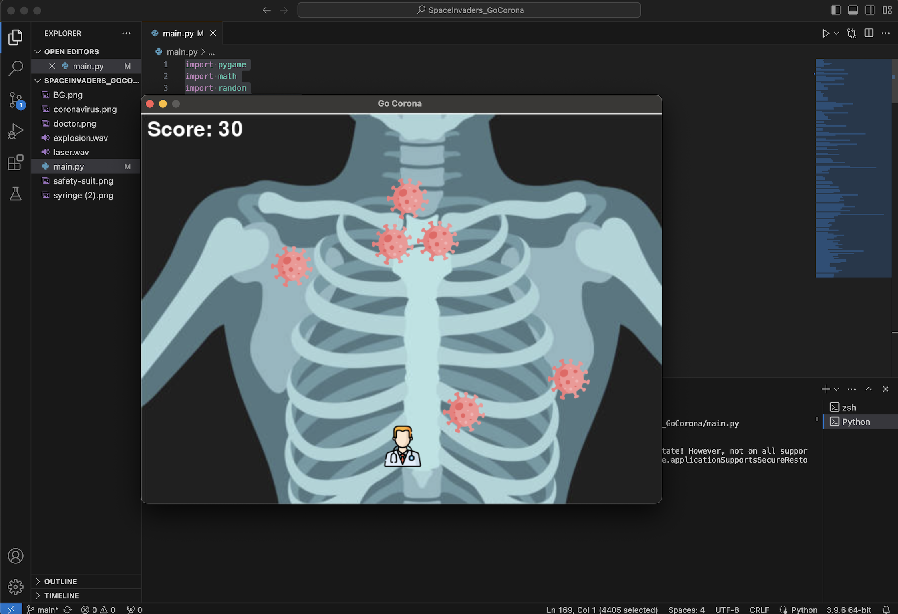
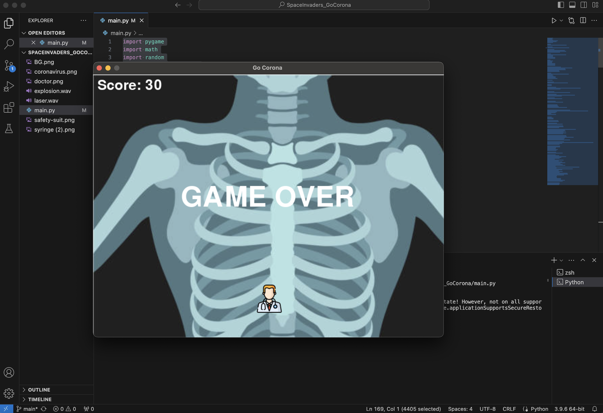

## Overview

"Go Corona" is a simple yet engaging 2D arcade-style game built using Python and the Pygame library. In this game, the player controls a doctor who shoots vaccines to eliminate coronavirus icons on the screen. The goal is to achieve the highest possible score before the viruses reach the bottom of the screen, which results in a "Game Over."

## How to Play

- **Move Left/Right:** Use the arrow keys (`←`/`→`) to move the doctor left and right across the screen.
- **Shoot Vaccine:** Press the `Space` bar to shoot a vaccine towards the viruses.
- **Objective:** Destroy as many viruses as possible by shooting them with the vaccine. Each destroyed virus increases your score.
- **Game Over:** The game ends when any virus reaches the bottom of the screen.

## Features

- **Background and Icons:** The game features a detailed X-ray background image, along with icons representing a doctor, the coronavirus, and a syringe for the vaccine.
- **Sound Effects:** Sound effects are played when a vaccine is fired and when a virus is destroyed.
- **Score Tracking:** The game tracks the player's score, which is displayed in the top left corner of the screen.
- **Game Over Screen:** When the game ends, a "GAME OVER" message is displayed.

## Installation

### Prerequisites

- Python 3.x
- Pygame library

### Installing Pygame

If you don't have Pygame installed, you can install it using pip:

```bash
pip install pygame
```

### Running the Game

1. Clone or download the repository to your local machine.
2. Navigate to the directory containing the game files.
3. Run the game using Python:

```bash
python3 main.py
```

## Screenshots

### Gameplay


### Game Over



